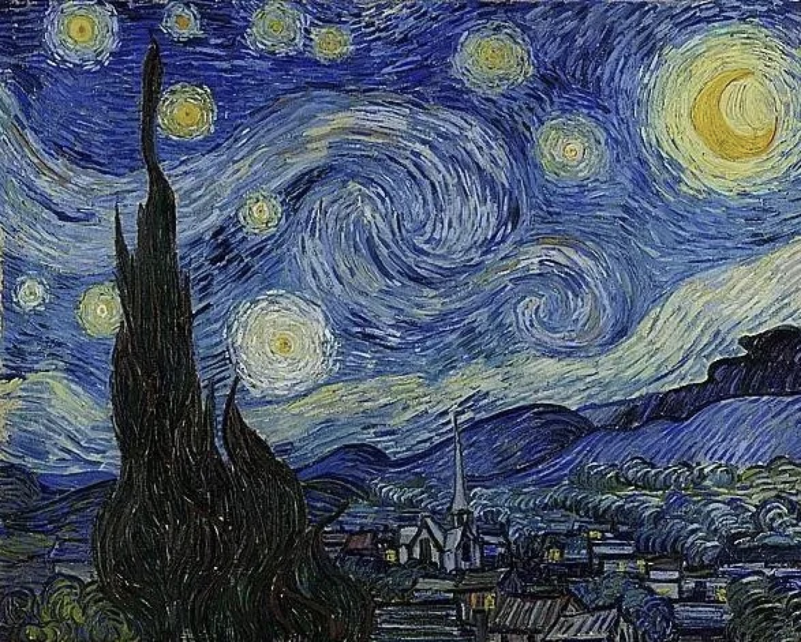
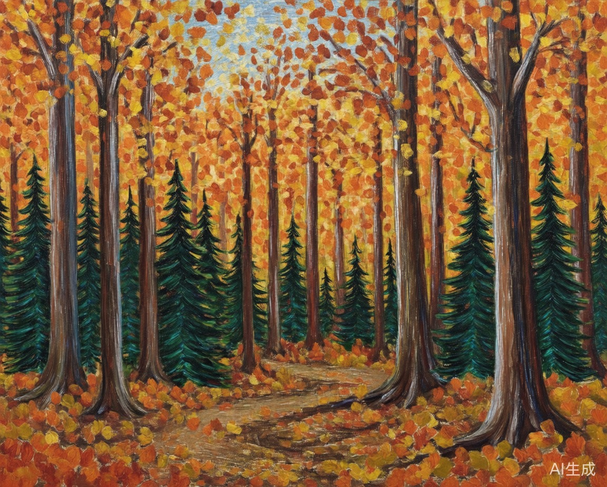
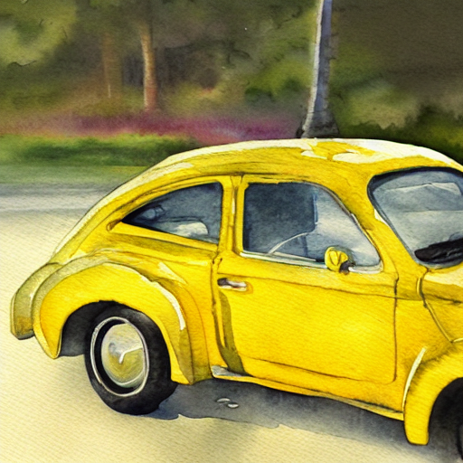
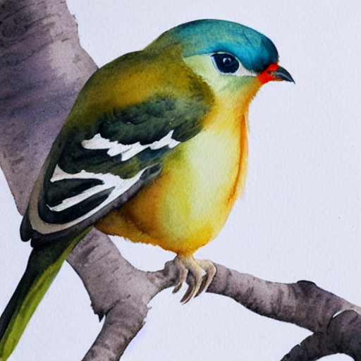
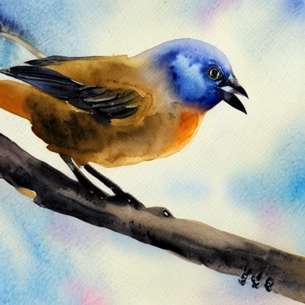
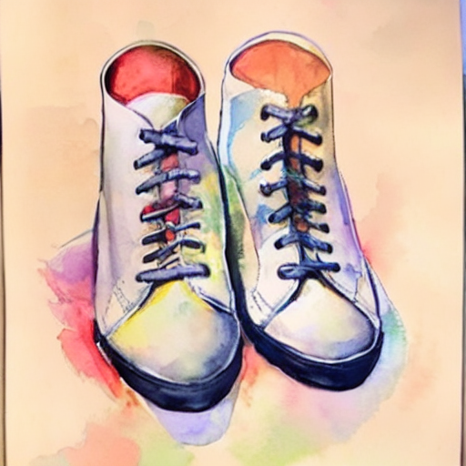
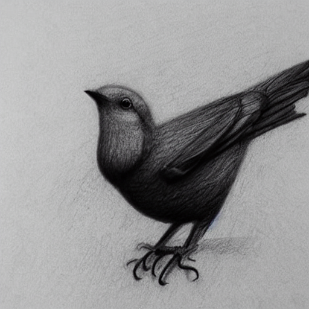

# similarity analysis of artistic styles
A promising tool to distinguish the style similarity of two images.  
Created by Xu Kaiyun.

---
## Demo
We provide a simple demo to show the image style similarity prediction.

### Input Images-1
<div align="center">


</div>

### Prediction Result-1
- Final Similarity Score: **0.8814**
- Conclusion: **Similar Style but different content**

### Input Images-2
<div align="center">


</div>

### Prediction Result-2
- Final Similarity Score: **0.6532**
- Conclusion: **Different Style but similar content**

### Input Images-3
<div align="center">


</div>

### Prediction Result-3
- Final Similarity Score: **0.9153**
- Conclusion: **Similar Style and Similar Content**

### Input Images-4
<div align="center">


</div>

### Prediction Result-4
- Final Similarity Score: **0.1064**
- Conclusion: **Different Style and Different Content**


### Similarity Score Band Definition
- **identical**: ≥ 0.90
  Example: Two images of cars painted in the style of Van Gogh

- **same_style_diff_content**: ~ 0.85
  Example: One image of a bird and another image of a car, both painted in the style of Van Gogh

- **same_content_diff_style**: ~ 0.35
  Example: One bird image in Van Gogh style, another bird image in watercolor style

- **completely_different**: ≤ 0.15
  Example: One bird image in Van Gogh style, another car image in watercolor style
---
## Methodology
Coming soon.
## Environment Setup
This project requires **Python 3.9.25** and a Conda environment.

### 1. Create and activate Conda environment
```bash
conda create -n dinov2 python=3.9.25 -y
conda activate dinov2
```
### 2. Install core dependencies via Conda
```bash
conda install -c conda-forge -c pytorch -c nvidia \
    pytorch=2.0.0 torchvision=0.15.0 cudatoolkit=11.7 \
    ffmpeg opencv matplotlib-base scikit-learn \
    numpy=1.26.4 pandas=2.2.2 scipy=1.13.1 \
    pillow tesseract openjpeg libtiff \
    tbb mkl mkl-include mkl-service \
    -y
```
### 3. Upgrade pip and install Python packages
```bash
pip install --upgrade pip
pip install -r requirements.txt
```
## Inference
```bash
python inference2.py \
  --input test_style.txt \
  --model best_graph_similarity_model_b.pt \
  --output predictions_test_style.csv \
  --base_dir ./selected_samples
```
